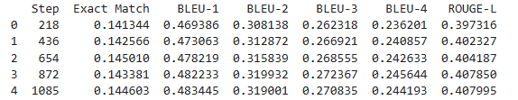
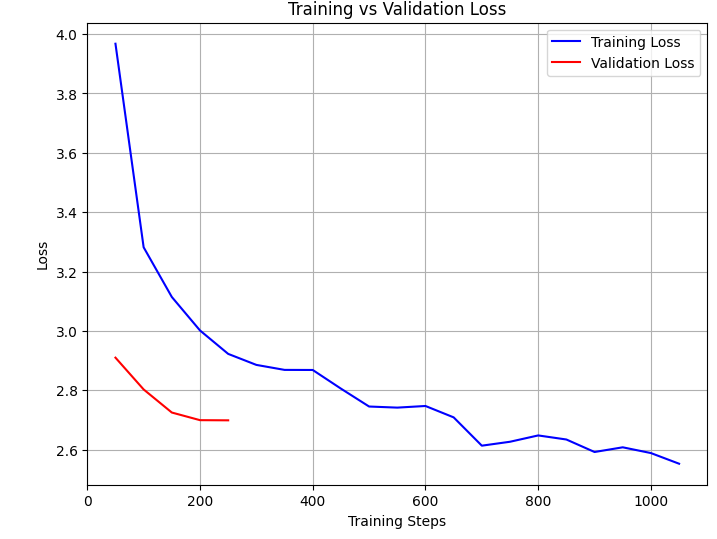
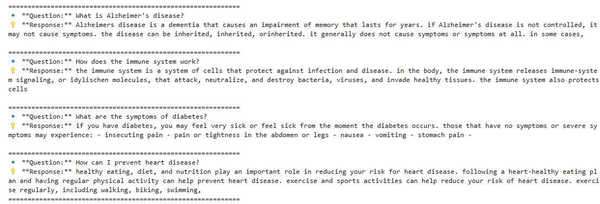

#   Medical Question Answering with T5

##  Project Overview
This project aims to develop an **AI-powered medical question-answering system** using the **T5 transformer model**. The goal is to enhance access to medical knowledge by generating accurate and context-aware responses to user queries. By leveraging transfer learning, the model is fine-tuned on a specialized medical dataset to improve response quality and relevance. This solution can assist both medical professionals and the general public in obtaining reliable answers to health-related questions.

##  Dataset

The dataset used for training is `medquad.csv`, which contains:
- Medical questions  
- Corresponding expert answers  
- Dataset available on Kaggle: [Link](https://www.kaggle.com/datasets/jpmiller/layoutlm)
  
### 🔹 Preprocessing Steps
- Dropping unnecessary columns
- Removing duplicates
- Cleaning text (removing special characters, lowercasing, etc.)
- Tokenizing the text using T5 tokenizer

##  Installation

To set up the environment and install dependencies, run:
Ensure you have `Python ` installed.

```bash
pip install transformers datasets torch evaluate scikit-learn matplotlib
```


##  Model
We use `T5-base`, a transformer-based seq2seq model pre-trained by Google. The model is fine-tuned on our medical dataset.

### 🔹 Model Configurations
- **Dropout Rate:** `0.1`
- **Feed Forward Projection:** `GELU`
- **Batch Size:** `16`
- **Optimizer:** `AdamW`
- **Learning Rate:** `6e-4`
- **Number of Epochs:** `5`

##  Training
### 🔹 Training Steps:
1. **Data Preprocessing**: Text cleaning and tokenization
2. **Dataset Splitting**: `85%` training, `15%` validation
3. **Fine-tuning**: Using `Seq2SeqTrainer`
4. **Evaluation**: Computing performance metrics
5. **Model Saving**: Saving trained weights and tokenizer
6. 

##  Evaluation
During evaluation, the following metrics are computed:

- **Exact Match (EM):** Measures how often the predicted answer matches the reference exactly.
- **BLEU Scores (1-4):** Measures precision at different n-gram levels.
- **ROUGE-L:** Measures recall-oriented overlap between predicted and reference answers.




##  Results Visualization
Below are the training and validation loss curves:



The loss curves indicate how well the model is learning over epochs.

##  Example Results

Here are some sample questions and their model-generated answers:



These responses demonstrate the model's ability to generate informative medical answers.


##  Model Saving
- **Trained Model:** `./t5_chatbot_model`
- **Tokenizer:** `./t5_chatbot_tokenizer`
- **Weights:** Saved as `t5_chatbot_model.pth`


